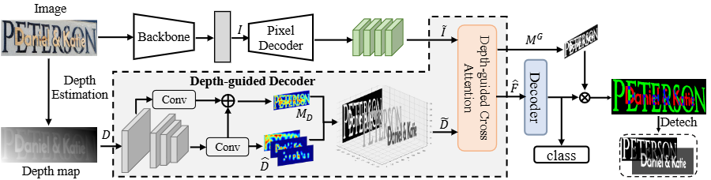
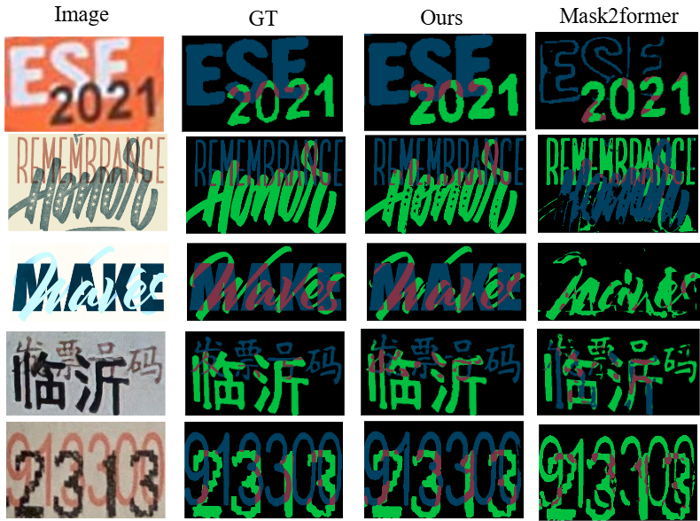

# Multi-scenario Overlapping Text Segmentation with Depth Awareness
<<<<<<< HEAD

Official PyTorch implementation of the ICCV paper "Overlapping Text Segmentation and Recognition". This codebase is built on top of the [MMSegmentation](https://github.com/open-mmlab/mmsegmentation) framework.

## Introduction

Overlapping text presents severe challenges for open-scene text perception tasks, while existing methods are mostly limited to document scenarios. To address this, we propose a multi-scenario overlapping text segmentation task and build a real English-Chinese dataset covering diverse scenes. We further introduce a hierarchical training data synthesis strategy to improve model generalization. Moreover, we utilize depth maps to provide 3D relative position cues and design a depth-guided decoder that fuses image and depth features to capture complex overlapping interactions between text instances.
<div align="center">
  
</div>

## Installation

We recommend using Conda to set up the environment, Please refer to [MMSegmentation Install Guide](https://mmsegmentation.readthedocs.io/en/latest/user_guides/index.html#) for more detailed instruction.

```bash
conda create -n mots python=3.8 -y
conda activate mots

# Install PyTorch
conda install pytorch torchvision cudatoolkit=11.1 -c pytorch -c nvidia

# Install MMSegmentation and dependencies
pip install -U openmim
mim install mmengine
mim install "mmcv>=2.0.0"

# Install this project
git clone -b main https://github.com/willpat1213/MOTS.git
cd MOTS
pip install -v -e .
```

## MOT Dataset

The MOT dataset consists of 1250 overlapping text images from diverse
and complex scenes. The dataset is available at [BaiduNetCloud](https://pan.baidu.com/s/1q09g8zhxbW8pyaxbnZrD8Q?pwd=5s68)

## Traning
Training on a single GPU, please use
```bash
python tools/train.py  ${CONFIG_FILE} [optional arguments]
```
Training on multiple GPUs, please use
```bash
sh tools/dist_train.sh ${CONFIG_FILE} ${GPU_NUM} [optional arguments]
```

For example, we use this script to train the model:
```bash
sh tools/dist_train.sh configs/overlap/mots_overlaptext.py 8
```

## Evaluation
Testing on a single GPU, please use
```bash
python tools/test.py ${CONFIG_FILE} ${CHECKPOINT_FILE} [optional arguments]
```
Training on multiple GPUs, please use
```bash
sh tools/dist_test.sh ${CONFIG_FILE} ${CHECKPOINT_FILE} ${GPU_NUM} [optional arguments]
```

For example, we use this script to train the model:
```bash
sh tools/dist_test.sh configs/overlap/mots_overlaptext.py 8
```

## Visualization
<div align="center">
  
</div>

## Citation
Please cite the following paper when using the MOT dataset or this repo.
```
@inproceedings{liu2025multi,
  title={Multi-scenario Overlapping Text Segmentation with Depth Awareness},
  author={Liu, Yang and Xie, Xudong and Liu, Yuliang and Bai, Xiang},
  booktitle={Proceedings of the IEEE/CVF International Conference on Computer Vision},
  pages={17454--17463},
  year={2025}
}
```

## Acknowledgement
This repo is based on [MMSegmentation](https://github.com/open-mmlab/mmsegmentation). We appreciate this wonderful open-source toolbox.
=======
Coming soon.
>>>>>>> 39cc9db36b048bd9e606dee3d55706cf247b4b29
